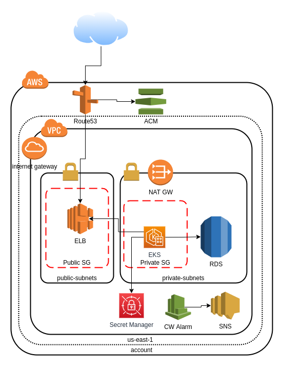

# Terraform-eks-bootstrap

## Introduction
This bootstrap creates a VPC and subnets, an RDS database and optional bastion host for accessing EKS worker nodes, if required. It also includes a module for a Cloudwatch alarm and SNS topic for billing purposes as well as basic IAM permissions for the EKS cluster.

## Blueprint


## Pre-requisites.
 * [Terraform 0.15.1](https://releases.hashicorp.com/terraform/0.15.1/)
 * The  `.terraform-version` will be used by `tfenv` utility, also  `version.tf` works with `tfenv` . It will install if needed and switch to the Terrraform version specified.

* tfenv  0.15.5tfutils/tfenv

## Environment variables needed to execute this deployment.
| Name | Value | Description |
|------|---------|--------|
|AWS_ACCESS_KEY_ID| n/a | n/a |
|AWS_SECRET_ACCESS_KEY| n/a | n/a |
|AWS_REGION | ca-central-1| n/a |
|ENV|< env >|n/a|

## Backend Requirements
  The Backend is the configuration service used to storage the instant snapshot from the infrastucture created.
* Create Backend Bucket
    * Bucket name: `project-terraform-state-<ENV>`
    * Object name: `<ENV>/project-eks-bootstrap.tfstate`

* [Create Backend Dynamo Table](https://www.terraform.io/docs/language/settings/backends/s3.html#dynamodb-state-locking)
    * Table name: `<ENV>-project-terraform-state-lock-dynamo`
    * Key: `LockID (string)`

## Requirements

| Name | Version |
|------|---------|
| <a name="requirement_terraform"></a> [terraform](#requirement\_terraform) | >= 0.15 |
| <a name="requirement_aws"></a> [aws](#requirement\_aws) | ~> 3.67.0 |

## Providers

| Name | Version |
|------|---------|
| <a name="provider_aws"></a> [aws](#provider\_aws) | 3.69.0 |
| <a name="provider_aws.use1"></a> [aws.use1](#provider\_aws.use1) | 3.69.0 |
| <a name="provider_kubernetes"></a> [kubernetes](#provider\_kubernetes) | 2.7.1 |
| <a name="provider_random"></a> [random](#provider\_random) | 3.1.0 |
| <a name="provider_tls"></a> [tls](#provider\_tls) | 3.1.0 |

## Modules

| Name | Source | Version |
|------|--------|---------|
| <a name="module_ec2_cluster"></a> [ec2\_cluster](#module\_ec2\_cluster) | terraform-aws-modules/ec2-instance/aws | ~> 2.0 |
| <a name="module_project_eks_cluster"></a> [project\_eks\_cluster](#module\_project\_eks\_cluster) | terraform-aws-modules/eks/aws | n/a |
| <a name="module_vpc"></a> [vpc](#module\_vpc) | terraform-aws-modules/vpc/aws | n/a |

## Resources

| Name | Type |
|------|------|
| [aws_cloudwatch_metric_alarm.billing](https://registry.terraform.io/providers/hashicorp/aws/latest/docs/resources/cloudwatch_metric_alarm) | resource |
| [aws_eip.nat](https://registry.terraform.io/providers/hashicorp/aws/latest/docs/resources/eip) | resource |
| [aws_eks_node_group.project-eks-cluster-nodegroup](https://registry.terraform.io/providers/hashicorp/aws/latest/docs/resources/eks_node_group) | resource |
| [aws_iam_group.K8sClusterAdmin-group](https://registry.terraform.io/providers/hashicorp/aws/latest/docs/resources/iam_group) | resource |
| [aws_iam_group.K8sDeveloper-group](https://registry.terraform.io/providers/hashicorp/aws/latest/docs/resources/iam_group) | resource |
| [aws_iam_group.K8sFullAdmin-group](https://registry.terraform.io/providers/hashicorp/aws/latest/docs/resources/iam_group) | resource |
| [aws_iam_group_policy_attachment.K8sClusterAdmin-group-policy-attach](https://registry.terraform.io/providers/hashicorp/aws/latest/docs/resources/iam_group_policy_attachment) | resource |
| [aws_iam_group_policy_attachment.K8sDeveloper-group-policy-attach](https://registry.terraform.io/providers/hashicorp/aws/latest/docs/resources/iam_group_policy_attachment) | resource |
| [aws_iam_group_policy_attachment.K8sFullAdmin-group-policy-attach](https://registry.terraform.io/providers/hashicorp/aws/latest/docs/resources/iam_group_policy_attachment) | resource |
| [aws_iam_policy.K8sClusterAdmin-group-policy](https://registry.terraform.io/providers/hashicorp/aws/latest/docs/resources/iam_policy) | resource |
| [aws_iam_policy.K8sDeveloper-group-policy](https://registry.terraform.io/providers/hashicorp/aws/latest/docs/resources/iam_policy) | resource |
| [aws_iam_policy.K8sFullAdmin-group-policy](https://registry.terraform.io/providers/hashicorp/aws/latest/docs/resources/iam_policy) | resource |
| [aws_iam_policy.eks-autoscale-policy](https://registry.terraform.io/providers/hashicorp/aws/latest/docs/resources/iam_policy) | resource |
| [aws_iam_policy.eks-cert-route53-policy](https://registry.terraform.io/providers/hashicorp/aws/latest/docs/resources/iam_policy) | resource |
| [aws_iam_role.K8sClusterAdmin-role](https://registry.terraform.io/providers/hashicorp/aws/latest/docs/resources/iam_role) | resource |
| [aws_iam_role.K8sDeveloper-role](https://registry.terraform.io/providers/hashicorp/aws/latest/docs/resources/iam_role) | resource |
| [aws_iam_role.K8sFullAdmin-role](https://registry.terraform.io/providers/hashicorp/aws/latest/docs/resources/iam_role) | resource |
| [aws_iam_role.eks-autoscale-role](https://registry.terraform.io/providers/hashicorp/aws/latest/docs/resources/iam_role) | resource |
| [aws_iam_role_policy.K8sClusterAdmin-role-policy](https://registry.terraform.io/providers/hashicorp/aws/latest/docs/resources/iam_role_policy) | resource |
| [aws_iam_role_policy.K8sDeveloper-role-policy](https://registry.terraform.io/providers/hashicorp/aws/latest/docs/resources/iam_role_policy) | resource |
| [aws_iam_role_policy.K8sFullAdmin-role-policy](https://registry.terraform.io/providers/hashicorp/aws/latest/docs/resources/iam_role_policy) | resource |
| [aws_iam_role_policy_attachment.autoscale-AmazonEC2ContainerRegistryReadOnly](https://registry.terraform.io/providers/hashicorp/aws/latest/docs/resources/iam_role_policy_attachment) | resource |
| [aws_iam_role_policy_attachment.autoscale-AmazonEKSClusterPolicy](https://registry.terraform.io/providers/hashicorp/aws/latest/docs/resources/iam_role_policy_attachment) | resource |
| [aws_iam_role_policy_attachment.autoscale-AmazonEKSWorkerNodePolicy](https://registry.terraform.io/providers/hashicorp/aws/latest/docs/resources/iam_role_policy_attachment) | resource |
| [aws_iam_role_policy_attachment.autoscale-AmazonEKS_CNI_Policy](https://registry.terraform.io/providers/hashicorp/aws/latest/docs/resources/iam_role_policy_attachment) | resource |
| [aws_iam_role_policy_attachment.autoscale-eks-autoscale-policy](https://registry.terraform.io/providers/hashicorp/aws/latest/docs/resources/iam_role_policy_attachment) | resource |
| [aws_iam_role_policy_attachment.autoscale-eks-route53Policy](https://registry.terraform.io/providers/hashicorp/aws/latest/docs/resources/iam_role_policy_attachment) | resource |
| [aws_key_pair.bastion_key_pair](https://registry.terraform.io/providers/hashicorp/aws/latest/docs/resources/key_pair) | resource |
| [aws_rds_cluster.rds_cluster](https://registry.terraform.io/providers/hashicorp/aws/latest/docs/resources/rds_cluster) | resource |
| [aws_security_group.bastion](https://registry.terraform.io/providers/hashicorp/aws/latest/docs/resources/security_group) | resource |
| [aws_sns_topic.sns_alert_topic](https://registry.terraform.io/providers/hashicorp/aws/latest/docs/resources/sns_topic) | resource |
| [aws_sns_topic_subscription.andres_email](https://registry.terraform.io/providers/hashicorp/aws/latest/docs/resources/sns_topic_subscription) | resource |
| [aws_sns_topic_subscription.ashu_email](https://registry.terraform.io/providers/hashicorp/aws/latest/docs/resources/sns_topic_subscription) | resource |
| [kubernetes_cluster_role.kubernetes_role_admin](https://registry.terraform.io/providers/hashicorp/kubernetes/latest/docs/resources/cluster_role) | resource |
| [kubernetes_cluster_role.kubernetes_role_dev](https://registry.terraform.io/providers/hashicorp/kubernetes/latest/docs/resources/cluster_role) | resource |
| [kubernetes_cluster_role_binding.kubernetes_binding_role_dev](https://registry.terraform.io/providers/hashicorp/kubernetes/latest/docs/resources/cluster_role_binding) | resource |
| [kubernetes_cluster_role_binding.new_role_binding](https://registry.terraform.io/providers/hashicorp/kubernetes/latest/docs/resources/cluster_role_binding) | resource |
| [random_integer.id-db](https://registry.terraform.io/providers/hashicorp/random/latest/docs/resources/integer) | resource |
| [random_password.password](https://registry.terraform.io/providers/hashicorp/random/latest/docs/resources/password) | resource |
| [random_pet.random](https://registry.terraform.io/providers/hashicorp/random/latest/docs/resources/pet) | resource |
| [tls_private_key.this](https://registry.terraform.io/providers/hashicorp/tls/latest/docs/resources/private_key) | resource |
| [aws_ami.amazon-linux-2-ami](https://registry.terraform.io/providers/hashicorp/aws/latest/docs/data-sources/ami) | data source |
| [aws_availability_zones.available](https://registry.terraform.io/providers/hashicorp/aws/latest/docs/data-sources/availability_zones) | data source |
| [aws_caller_identity.current](https://registry.terraform.io/providers/hashicorp/aws/latest/docs/data-sources/caller_identity) | data source |
| [aws_eks_cluster.cluster](https://registry.terraform.io/providers/hashicorp/aws/latest/docs/data-sources/eks_cluster) | data source |
| [aws_eks_cluster_auth.cluster](https://registry.terraform.io/providers/hashicorp/aws/latest/docs/data-sources/eks_cluster_auth) | data source |

## Inputs

| Name | Description | Type | Default | Required |
|------|-------------|------|---------|:--------:|
| <a name="input_actions"></a> [actions](#input\_actions) | n/a | `list` | `[]` | no |
| <a name="input_api_groups"></a> [api\_groups](#input\_api\_groups) | n/a | `list` | `[]` | no |
| <a name="input_billing_currency"></a> [billing\_currency](#input\_billing\_currency) | n/a | `string` | `"USD"` | no |
| <a name="input_bucket_cluster_logs_name"></a> [bucket\_cluster\_logs\_name](#input\_bucket\_cluster\_logs\_name) | n/a | `string` | `"project_eks_logs"` | no |
| <a name="input_cluster_logs_path"></a> [cluster\_logs\_path](#input\_cluster\_logs\_path) | n/a | `string` | `"cluster_logs"` | no |
| <a name="input_cluster_max_node_count"></a> [cluster\_max\_node\_count](#input\_cluster\_max\_node\_count) | n/a | `number` | `2` | no |
| <a name="input_cluster_min_node_count"></a> [cluster\_min\_node\_count](#input\_cluster\_min\_node\_count) | n/a | `number` | `1` | no |
| <a name="input_cluster_node_billing_mode"></a> [cluster\_node\_billing\_mode](#input\_cluster\_node\_billing\_mode) | n/a | `string` | `"SPOT"` | no |
| <a name="input_cluster_node_disk_size"></a> [cluster\_node\_disk\_size](#input\_cluster\_node\_disk\_size) | n/a | `string` | `"200"` | no |
| <a name="input_cluster_node_instance_type"></a> [cluster\_node\_instance\_type](#input\_cluster\_node\_instance\_type) | n/a | `list(string)` | `[]` | no |
| <a name="input_cluster_public_access"></a> [cluster\_public\_access](#input\_cluster\_public\_access) | n/a | `bool` | n/a | yes |
| <a name="input_cni_enabled"></a> [cni\_enabled](#input\_cni\_enabled) | n/a | `bool` | n/a | yes |
| <a name="input_count_eip_nat"></a> [count\_eip\_nat](#input\_count\_eip\_nat) | n/a | `number` | `1` | no |
| <a name="input_create_bastion"></a> [create\_bastion](#input\_create\_bastion) | n/a | `number` | `1` | no |
| <a name="input_create_vpc"></a> [create\_vpc](#input\_create\_vpc) | n/a | `bool` | `true` | no |
| <a name="input_db_backup_retention"></a> [db\_backup\_retention](#input\_db\_backup\_retention) | n/a | `number` | `5` | no |
| <a name="input_db_backup_window"></a> [db\_backup\_window](#input\_db\_backup\_window) | n/a | `string` | `"07:00-09:00"` | no |
| <a name="input_db_master_user"></a> [db\_master\_user](#input\_db\_master\_user) | n/a | `any` | n/a | yes |
| <a name="input_db_name"></a> [db\_name](#input\_db\_name) | n/a | `any` | n/a | yes |
| <a name="input_dev_users"></a> [dev\_users](#input\_dev\_users) | n/a | `list` | `[]` | no |
| <a name="input_ecr_name"></a> [ecr\_name](#input\_ecr\_name) | n/a | `string` | `"project_eks_ecr"` | no |
| <a name="input_eks_cluster_name"></a> [eks\_cluster\_name](#input\_eks\_cluster\_name) | n/a | `string` | `"project_eks_cluster"` | no |
| <a name="input_eks_cluster_version"></a> [eks\_cluster\_version](#input\_eks\_cluster\_version) | n/a | `string` | `"1.19.8"` | no |
| <a name="input_eks_master_role"></a> [eks\_master\_role](#input\_eks\_master\_role) | n/a | `string` | n/a | yes |
| <a name="input_enable_natgateway"></a> [enable\_natgateway](#input\_enable\_natgateway) | n/a | `bool` | `true` | no |
| <a name="input_enable_vpngateway"></a> [enable\_vpngateway](#input\_enable\_vpngateway) | n/a | `bool` | `false` | no |
| <a name="input_engine_version"></a> [engine\_version](#input\_engine\_version) | n/a | `string` | `"5.7.mysql_aurora.2.03.2"` | no |
| <a name="input_env"></a> [env](#input\_env) | n/a | `string` | `"dev"` | no |
| <a name="input_external_nat_ip_ids"></a> [external\_nat\_ip\_ids](#input\_external\_nat\_ip\_ids) | n/a | `list` | <pre>[<br>  ""<br>]</pre> | no |
| <a name="input_map_accounts"></a> [map\_accounts](#input\_map\_accounts) | Additional AWS account numbers to add to the aws-auth configmap. | `list(string)` | `[]` | no |
| <a name="input_map_roles"></a> [map\_roles](#input\_map\_roles) | Additional IAM roles to add to the aws-auth configmap. | <pre>list(object({<br>    rolearn  = string<br>    username = string<br>    groups   = list(string)<br>  }))</pre> | `[]` | no |
| <a name="input_map_users"></a> [map\_users](#input\_map\_users) | Additional IAM users to add to the aws-auth configmap. | <pre>list(object({<br>    userarn  = string<br>    username = string<br>    groups   = list(string)<br>  }))</pre> | `[]` | no |
| <a name="input_monthly_billing_threshold"></a> [monthly\_billing\_threshold](#input\_monthly\_billing\_threshold) | n/a | `number` | `500` | no |
| <a name="input_namespace_name"></a> [namespace\_name](#input\_namespace\_name) | n/a | `string` | `"default"` | no |
| <a name="input_node_logs_path"></a> [node\_logs\_path](#input\_node\_logs\_path) | n/a | `string` | `"node_logs"` | no |
| <a name="input_owner_tag"></a> [owner\_tag](#input\_owner\_tag) | n/a | `string` | `"DevOps Team"` | no |
| <a name="input_private_subnets"></a> [private\_subnets](#input\_private\_subnets) | n/a | `list` | <pre>[<br>  "10.1.1.0/24",<br>  "10.1.2.0/24"<br>]</pre> | no |
| <a name="input_private_subnets_ids"></a> [private\_subnets\_ids](#input\_private\_subnets\_ids) | n/a | `list` | `[]` | no |
| <a name="input_public_subnets"></a> [public\_subnets](#input\_public\_subnets) | n/a | `list` | <pre>[<br>  "10.1.3.0/24",<br>  "10.1.4.0/24"<br>]</pre> | no |
| <a name="input_public_subnets_ids"></a> [public\_subnets\_ids](#input\_public\_subnets\_ids) | n/a | `list` | `[]` | no |
| <a name="input_rds_cluster_name"></a> [rds\_cluster\_name](#input\_rds\_cluster\_name) | n/a | `any` | n/a | yes |
| <a name="input_rds_engine"></a> [rds\_engine](#input\_rds\_engine) | n/a | `string` | `"aurora-mysql"` | no |
| <a name="input_region"></a> [region](#input\_region) | n/a | `string` | `"us-east-1"` | no |
| <a name="input_resource_names"></a> [resource\_names](#input\_resource\_names) | n/a | `list` | `[]` | no |
| <a name="input_resources"></a> [resources](#input\_resources) | n/a | `list` | `[]` | no |
| <a name="input_role_name"></a> [role\_name](#input\_role\_name) | n/a | `string` | `"test_role"` | no |
| <a name="input_username"></a> [username](#input\_username) | n/a | `list` | `[]` | no |
| <a name="input_vpc_cidr"></a> [vpc\_cidr](#input\_vpc\_cidr) | n/a | `string` | `"10.1.0.0/16"` | no |
| <a name="input_vpc_id"></a> [vpc\_id](#input\_vpc\_id) | n/a | `string` | `""` | no |
| <a name="input_vpc_name"></a> [vpc\_name](#input\_vpc\_name) | n/a | `string` | `"project_eks_vpc"` | no |

## Outputs

| Name | Description |
|------|-------------|
| <a name="output_private_key"></a> [private\_key](#output\_private\_key) | n/a |
| <a name="output_project_eks_cluster_id"></a> [project\_eks\_cluster\_id](#output\_project\_eks\_cluster\_id) | n/a |
| <a name="output_vpc_data"></a> [vpc\_data](#output\_vpc\_data) | n/a |


## Execution Steps

* Clone Repo

  * git clone git@github.com:xerris/terraform-eks-bootstrap.git

  * cd terraform-eks-bootstrap

* Initialize the Environment Variables
    ```
    export AWS_ACCESS_KEY_ID="XXXXXXXXXXXXXXXXXXXXXXXXXXX"
    export AWS_SECRET_ACCESS_KEY="YYYYYYYYYYYYYYYYYYYYYYYYY"
    export AWS_REGION="ca-central-1"
    #Dont for get to set ENV variable(as “dev“ or “stage“ or “prod“  )
    #We have 3 predefine templated inside folder envs
    export ENV="dev"
    ```

* Edit file  terraform-eks-bootstrap/terraform_exec.sh

    * Set the name of the S3 bucket and S3 Object name for your backend (Remeber AWS S3 bucket name is unique globally )

    * For example lets assume that the enviroment We want to deploy is dev you need to create a unique S3 bucket called `xerris-eks-terraform-state-dev ` and a DynamoDB table called `dev-xerris-eks-terraform-state-lock-dynamo`

    * Set the name of your DynamoDb table to control the locking for the state file.
        ```
        terraform init \
        -upgrade \
        -backend-config="bucket=xerris-eks-terraform-state-${ENV}" \
        -backend-config="key=${ENV}/xerris-eks-bootstrap.tfstate" \
        -backend-config="dynamodb_table=${ENV}-xerris-eks-terraform-state-lock-dynamo" \
        -backend-config="region=${AWS_REGION}"
        ```

    * In the case you want to test without dynamodb table, Just remove below line from file `terraform-eks-bootstrap/terraform_exec.sh`

        ```
        -backend-config="dynamodb_table=${ENV}-xerris-eks-terraform-state-lock-dynamo" \
        ```

    * The `terraform_exec.sh` script receives one parameter that indicates the action to be executed.
        ```
        0 = Executes a terraform plan
        1 = Executes a terraform apply
        2 = Executes a terraform destroy
        ```

    * Execute a Terraform Plan on the project folder

        ```
        bash  terraform_exec.sh 0
        ```

    * Execute a Terraform apply on the project folder

        ```
        bash  terraform_exec.sh 1
        ```

    * Execute a Terraform Destroy on the project folder

        ```
        bash  terraform_exec.sh 2
        ```